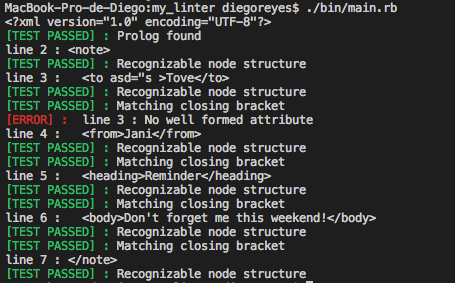

# XML Begginer linter

This a ruby based linter for XML files. It provides feedback about syntaxis errors for XML files.

# Preview


# How it works

**This version of the XML Begginer linter reads the ./test.xml file included in the project.** This XML file linter will catch and display the following syntax errors in the console :

- There is no well formed PROLOG in the first line of the file
- There is a PROLOG, but it's not well formed (a '?>' closing tag is missing)
- There is not a root node
- There is more than one root node
- There is a malformed node
- There is an unrecognizable node (`asd <w >s`)
- There is no matching tag for a given node ( `<order>val</adorder> `)
- There is no closing tag for a multiline node
- There are no well formed attributes (`<order attr='val">`)
- An inline node has empty value (`<order></order>`)

The base test.xml file the program reads is included in the project in the root directory folder, however you can change its content to suit your testing needs. Here is the base content of the test.xml file: 

[**The 'asd' attribute is malformed on purpose to showcase linter functionalities**]
  ```xml
  <?xml version="1.0" encoding="UTF-8"?>
  <note>
    <to asd="s >Tove</to>
    <from>Jani</from>
    <heading>Reminder</heading>
    <body>Don't forget me this weekend!</body>
  </note>
  ```

## Examples

- Case : Root node closing tag missing
  ```xml
  <?xml version="1.0" encoding="UTF-8"?>
  <note>
    <to asd="s" >Tove</to>
    <from>Jani</from>
    <heading>Reminder</heading>
    <body>Don't forget me this weekend!</body>
  ```
  - Linter output: 

    

- Case : Node opening tag and closing tag mismatch
  ```xml
    <?xml version="1.0" encoding="UTF-8"?>
    <note>
      <to asd="s" >Tove</to>
      <from>Jani</fromda>
      <heading>Reminder</heading>
      <body>Don't forget me this weekend!</body>
    </note>
  ```
  - Linter output: 

    

# How to run the linter
First of all, you need to have the linter files in your computer. You can get them either cloning this repository, or downloading its contents directly
- To clone the repo, go on the project's [Github page](https://github.com/xtrmdarc/my_linter), click on "Clone or download", copy the contents of the text box, and then run `git clone "repo"` on the command line, where "repo" is the text you just copied.
- If you want to download it directly instead, go on the project's [Github page](https://github.com/xtrmdarc/my_linter), click on "Clone or download", and then on "Download ZIP". After this you need to extract the contents of the zip file on your computer.

Once you have the files on your computer, go on the command line and navigate to the game directory. Once there :

- **Change the content of the test.xml file to suit your testing needs**
- Run the linter directly from the executable file, using the command `./bin/main.rb`
- Pass the main.rb file to the ruby interpreter, using the command `ruby bin/main.rb`

# Requirements

- Ruby > 2.5
- Colorize
- Rubocop

## Built With

- Ruby

## Author

👤 **Diego Antonio Reyes Coronado**

- Github: [@xtrmdarc](https://github.com/xtrmdarc)
- Twitter: [@diegoreyesco](https://twitter.com/DiegoAn91629127)
- Linkedin: [diegoreyesco](https://www.linkedin.com/in/diego-reyes-coronado-7a7189b7/)

## 🤝 Contributing

Contributions, issues and feature requests are welcome!

Feel free to check the [issues page](issues/).

## Show your support

Give a ⭐️ if you like this project!
